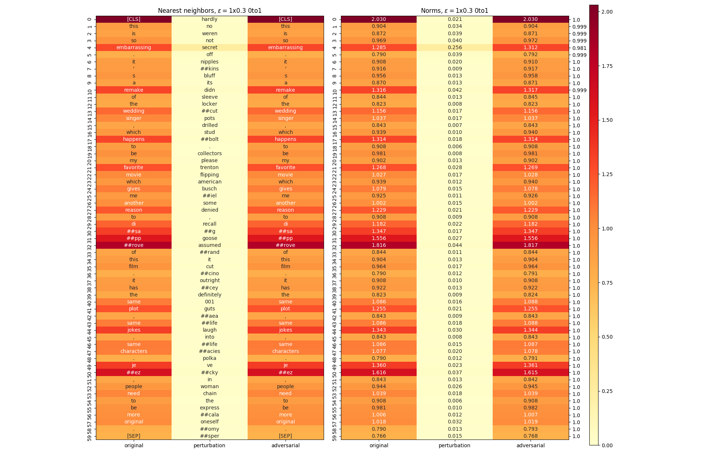

# Adversarial embeddings for BERT

Adversarial embedding generation and analysis on top of BERT for sentiment classification on [IMDB Large Move Review Dataset](https://ai.stanford.edu/~amaas/data/sentiment/). Built on top of the [Chainer reimplementation](https://github.com/soskek/bert-chainer) of the Google Research's [original TensorFlow implementation](https://github.com/google-research/bert). IMDB loader and processor functions taken from [this branch](https://github.com/hsm207/bert/tree/imdb).



Repository also includes an algorithm for projecting the adversarial embeddings to obtain adversarial discrete text candidates. Although the algorithm employs simple heuristics to make small and allowed changes, the meaning of the sentence may change as the adversary usually targets sentiment carrying tokens.


## Related Work

- [Interpretable Adversarial Training for Text](https://arxiv.org/abs/1905.12864) by Barham and Feizi
- [Interpretable Adversarial Perturbation in Input Embedding Space for Text](https://arxiv.org/abs/1805.02917) by Sato et al.
- [Adversarial Training Methods for Semi-Supervised Text Classification](https://arxiv.org/abs/1605.07725) by Miyato et al.
- [BERT: Pre-training of Deep Bidirectional Transformers for Language Understanding](https://arxiv.org/abs/1810.04805) by Devlin et al.

## Requirements

- Python (3.6.4)
- Chainer (6.0.0)
- CuPy (6.1.0)

## Installation

Install packages if they are not already present.
```bash
pip install cupy-cuda90 --no-cache-dir --user
pip install chainer --user
```

Clone and enter the repository.
```bash
# cd /cluster/scratch/nethzid
git clone https://github.com/dcetin/bert-chainer.git
cd bert-chainer
# module load python_cpu/3.6.4 cuda/9.0.176
```

Download and load the pretrained TensorFlow BERT checkpoints.

```bash
wget 'https://storage.googleapis.com/bert_models/2018_10_18/uncased_L-12_H-768_A-12.zip'
unzip uncased_L-12_H-768_A-12.zip
export BERT_BASE_DIR=./uncased_L-12_H-768_A-12
python convert_tf_checkpoint_to_chainer.py \
  --tf_checkpoint_path $BERT_BASE_DIR/bert_model.ckpt \
  --npz_dump_path $BERT_BASE_DIR/arrays_bert_model.ckpt.npz
rm uncased_L-12_H-768_A-12.zip
```

Download and extract the IMDB dataset.
```bash
wget 'https://ai.stanford.edu/~amaas/data/sentiment/aclImdb_v1.tar.gz'
tar -xzf aclImdb_v1.tar.gz
python create_imdb_dataset.py
rm aclImdb_v1.tar.gz
```

Download the model checkpoint, if hasn't done before.
```bash
wget 'https://n.ethz.ch/~dcetin/download/model_snapshot_iter_2343_max_seq_length_128.npz' -P base_models
```

## Usage

Example command (can be found in train_imdb.sh as well) to run the experiments block of the code. Change last four options accordingly for the desired usage.
```bash
# module load python_gpu/3.6.4 cuda/9.0.176
# bsub -n 4 -W 4:00 -R "rusage[mem=1024, ngpus_excl_p=1]" \
python run_classifier.py \
  --task_name=IMDB \
  --data_dir=aclImdb \
  --vocab_file $BERT_BASE_DIR/vocab.txt \
  --bert_config_file $BERT_BASE_DIR/bert_config.json \
  --init_checkpoint $BERT_BASE_DIR/arrays_bert_model.ckpt.npz \
  --max_seq_length=128 \
  --train_batch_size=16 \
  --learning_rate=2e-5 \
  --num_train_epochs=3 \
  --output_dir=./out_imdb \
  --do_train=false \
  --do_eval=false \
  --do_resume=true \
  --do_experiment=true \
```

## Notes

- **basic** directory contains code for adversarial embedding generation, evaluation and visualization on a network model of much smaller scale (i.e. a multi step LSTM and a linear layer as an encoder instead of BERT). **It also implements adversarial training** with an unrolled training loop. See also its own readme file.
- Features the classifier utilize (i.e. output of the penultimate layer, pooled encodings) for all evaluation runs (standard and all four adversarial cases) can be found online. It is what the save_outputs function creates and writes.
```bash
wget 'https://n.ethz.ch/~dcetin/download/train_test_outputs.pickle'
```

- Output the summary_statistics function dumps can also be found online. One can simply call summary_histogram or any other function on the sampled data.
```bash
wget 'https://n.ethz.ch/~dcetin/download/summary_data_10000_5_5.pickle'
```

- Training/evaluation on GLUE tasks (e.g. MRPC) can be done as shown below, after downloading the TensorFlow BERT checkpoints. Be aware that some experimental functions are explicitly written for IMDB dataset and may not work or work in unintended ways for other tasks.
```bash
# module load python_cpu/3.6.4 cuda/9.0.176
wget "https://n.ethz.ch/~dcetin/download/download_glue_data.py"
python download_glue_data.py
export GLUE_DIR=./glue_data
```
```bash
# module load python_gpu/3.6.4 cuda/9.0.176
# bsub -n 6 -W 4:00 -R "rusage[mem=1024, ngpus_excl_p=1]" -R "select[gpu_model0==TeslaV100_SXM2_32GB]" \
python run_classifier.py \
  --task_name MRPC \
  --data_dir $GLUE_DIR/MRPC/ \
  --vocab_file $BERT_BASE_DIR/vocab.txt \
  --bert_config_file $BERT_BASE_DIR/bert_config.json \
  --init_checkpoint $BERT_BASE_DIR/arrays_bert_model.ckpt.npz \
  --max_seq_length 128 \
  --train_batch_size 16 \
  --learning_rate 2e-5 \
  --num_train_epochs 3.0 \
  --output_dir=./mrpc_output
  --do_train True \
  --do_eval True \
  --do_lower_case True \
```
